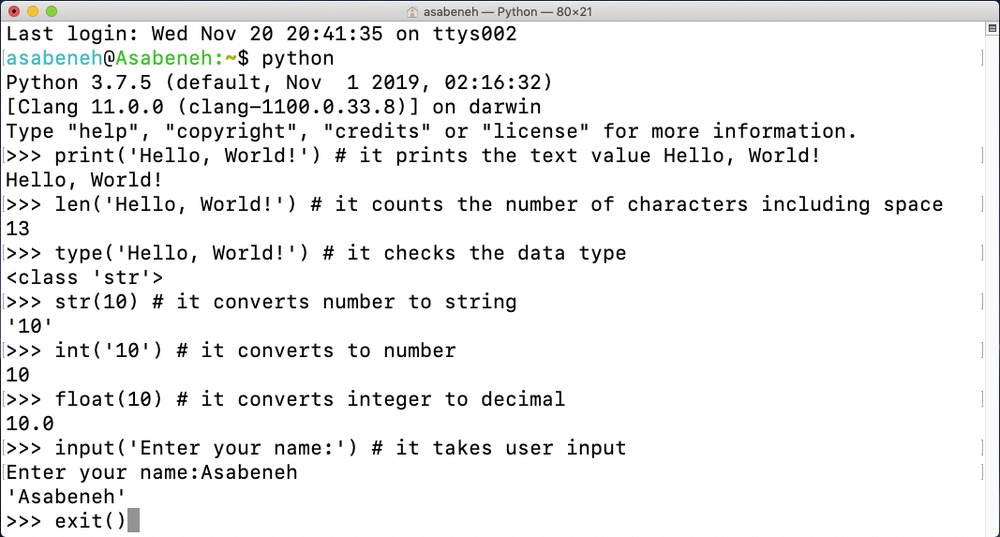

<div align="center">
  <h1> 30 Günde Python: 2. Gün - Değişkenler, Yerleşik İşlevler</h1>
  <a class="header-badge" target="_blank" href="https://www.linkedin.com/in/asabeneh/">
  
  </a>
  <a class="header-badge" target="_blank" href="https://twitter.com/Asabeneh">
  
  </a>
<sub>Yazar:
<a href="https://www.linkedin.com/in/asabeneh/" target="_blank">Asabeneh Yetayeh</a><br>
<small> Second Edition: July, 2021</small>
</sub>
</div>

[<< 1.Gün ](../benioku.md) | [Day 3 >>](../Gün_03/operatörler.md)


- [📘 2.Gün ](#-2.-gün)
  - [Dahili işlevler](#dahili-işlevler)
  - [Değişkenler](#değişkenler)
    - [Bir Satırda Birden Çok Değişken Bildirmek](#bir-satırda-birden-çok-değişken-bildirmek)
  - [Veri Tipleri](#veri-tipleri)
  - [Veri türlerini ve Yayınlamayı Kontrol Etme](#veri-türlerini-ve-yayınlamayı-kontrol-etme)
  - [Sayılar](#sayılar)
  - [💻 Alıştırma - 2. Gün ](#-alıştırma-2.gün)
    - [Alıştırma: Seviye 1](#alıştırma-seviye-1)
    - [Alıştırma: Seviye 2](#alıştırma-seviye-2)

# 📘 2. Gün

## Dahili işlevler

Python'da birçok yerleşik işlevimiz var. Yerleşik işlevler, kullanımınız için kütüphane içinde hazır gelir; bu, yerleşik işlevlerden içe aktarma veya yapılandırma yapmadan yararlanabileceğiniz anlamına gelir. En sık kullanılan Python yerleşik işlevlerinden bazıları şunlardır: _print()_, _len()_, _type()_, _int()_, _float()_, _str()_, _input()_, _list()_, _dict()_, _min()_, _max()_, _sum()_, _sorted()_, _open()_, _file()_, _help()_, ve _dir()_. Aşağıdaki tabloda, Python yerleşik işlevlerinin kapsamlı bir listesini göreceksiniz. [python documentation](https://docs.python.org/3.9/library/functions.html).


Python derleyicisini açalım ve en yaygın yerleşik işlevlerden bazılarını kullanmaya başlayalım.



Farklı yerleşik işlevleri kullanarak daha fazla pratik yapalım


Yukarıdaki terminalden de görebileceğiniz gibi Python'un ayrılmış kelimeleri var. Değişkenleri veya işlevleri bildirmek için ayrılmış sözcükler kullanmıyoruz. Bir sonraki bölümde değişkenleri ele alacağız.

Artık yerleşik işlevlere aşina olduğunuza inanıyorum. Yerleşik işlevlerle ilgili bir alıştırma daha yapalım ve sonraki bölüme geçelim.


## Değişkenler

Değişkenler, verileri bir bilgisayar belleğinde saklar. Anımsatıcı değişkenlerin birçok programlama dilinde kullanılması önerilir. AAnımsatıcı değişken, kolayca hatırlanabilen ve ilişkilendirilebilen bir değişken adıdır. Değişken, verilerin depolandığı bir bellek adresini ifade eder.
Değişken isimlendirilirken başında sayı, özel karakter, kısa çizgi kullanılmasına izin verilmez. Bir değişkenin kısa bir adı olabilir (x, y, z gibi), ancak daha açıklayıcı bir ad (ad, soyad, yaş, ülke) şiddetle tavsiye edilir.

Python Değişken Adı Kuralları

- Değişken adı bir harf veya alt çizgi karakteri ile başlamalıdır
- Değişken ismi sayı ile başlayamaz
- Değişken adı yalnızca alfasayısal karakterler ve alt çizgiler içerebilir (A-z, 0-9 ve \_ )
- Değişken adları büyük/küçük harfe duyarlıdır (ad, Ad, Ad ve FIRSTNAME) farklı değişkenlerdir)

Geçerli değişken adlarını görelim

```shell
firstname
lastname
age
country
city
first_name
last_name
capital_city
_if # ayrılmış kelimeyi değişken olarak kullanmak istiyorsak
year_2021
year2021
current_year_2021
birth_year
num1
num2
```

Geçersiz değişken adları

```shell
first-name
first@name
first$name
num-1
1num
```

Birçok Python geliştiricisi tarafından benimsenen standart Python değişken adlandırma stilini kullanacağız. Python geliştiricileri, snake case(snake_case) değişken adlandırma kuralı kullanır. Birden fazla kelime içeren bir değişken için her kelimeden sonra alt çizgi karakteri kullanırız (örn. first_name, last_name, engine_rotation_speed). Aşağıdaki örnek, değişkenlerin standart adlandırılmasına bir örnektir, değişken adı birden fazla kelime olduğunda alt çizgi gereklidir.

Bir değişkene belirli bir veri tipi atadığımızda buna değişken bildirimi denir. Örneğin aşağıdaki örnekte benim adım bir first_name değişkenine atanmıştır. Eşittir işareti bir atama operatörüdür. Atama, değişkende veri depolamak anlamına gelir. Python'daki eşittir işareti, Matematikteki gibi eşitlik değildir..

_Örnek:_

```py
# Python'da Değişkenler
first_name = 'Asabeneh'
last_name = 'Yetayeh'
country = 'Finland'
city = 'Helsinki'
age = 250
is_married = True
skills = ['HTML', 'CSS', 'JS', 'React', 'Python']
person_info = {
   'firstname':'Asabeneh',
   'lastname':'Yetayeh',
   'country':'Finland',
   'city':'Helsinki'
   }
```

_print()_ ve _len()_ yerleşik işlevlerini kullanalım. Yazdırma işlevi sınırsız sayıda argüman alır. Argüman, iletebileceğimiz veya fonksiyon parantezinin içine koyabileceğimiz bir değerdir, aşağıdaki örneğe bakın.

**Örnek:**

```py
print('Hello, World!') # Metin Hello, World! bir argümandır
print('Hello',',', 'World','!') # birden fazla argüman alabilir, dört argüman iletildi
print(len('Hello, World!')) # sadece bir argüman alır
```

En üstte belirtilen değişkenlerin uzunluğunu yazdıralım ve bulalım:

**Örnek:**

```py
# Printing the values stored in the variables

print('First name:', first_name)
print('First name length:', len(first_name))
print('Last name: ', last_name)
print('Last name length: ', len(last_name))
print('Country: ', country)
print('City: ', city)
print('Age: ', age)
print('Married: ', is_married)
print('Skills: ', skills)
print('Person information: ', person_info)
```

### Bir Satırda Birden Çok Değişken Bildirmek

Bir satırda birden çok değişken de bildirilebilir:

**Örnek:**

```py
first_name, last_name, country, age, is_married = 'Asabeneh', 'Yetayeh', 'Helsink', 250, True

print(first_name, last_name, country, age, is_married)
print('First name:', first_name)
print('Last name: ', last_name)
print('Country: ', country)
print('Age: ', age)
print('Married: ', is_married)
```

_input()_ yerleşik işlevini kullanarak kullanıcı girdisi alma. Bir kullanıcıdan aldığımız verileri first_name ve age değişkenlerine atayalım.
**Örnek:**

```py
first_name = input('What is your name: ')
age = input('How old are you? ')

print(first_name)
print(age)
```
## Veri Tipleri

Python'da birkaç veri türü vardır. Veri türünü belirlemek için yerleşik _type_ işlevini kullanırız. Farklı veri tiplerini çok iyi anlamaya odaklanmanızı rica ediyorum. Programlama söz konusu olduğunda, her şey veri türleri ile ilgilidir. En başta veri türlerini tanıttım ve tekrar geliyor, çünkü her konu veri türleri ile ilgilidir. Veri türlerini ilgili bölümlerinde daha ayrıntılı olarak ele alacağız.


## Veri türlerini ve Yayınlamayı Kontrol Etme

- Veri türlerini kontrol edin: Belirli verilerin/değişkenlerin veri türünü kontrol etmek için _type_ kullanırız.
  **Örnek:**

```py
# Farklı python veri türleri
# Değişkenleri çeşitli veri türleri ile tanımlayalım

first_name = 'Asabeneh'     # str
last_name = 'Yetayeh'       # str
country = 'Finland'         # str
city= 'Helsinki'            # str
age = 250                   # int, bu benim gerçek yaşım değil merak etme

# Printing out types
print(type('Asabeneh'))     # str
print(type(first_name))     # str
print(type(10))             # int
print(type(3.14))           # float
print(type(1 + 1j))         # complex
print(type(True))           # bool
print(type([1, 2, 3, 4]))     # list
print(type({'name':'Asabeneh','age':250, 'is_married':250}))    # dict
print(type((1,2)))                                              # tuple
print(type(zip([1,2],[3,4])))                                   # set
```

- Döküm: Bir veri tipini başka bir veri tipine dönüştürme. _int()_, _float()_, _str()_, _list_, _set_ kullanıyoruz
  Aritmetik işlemler yaptığımızda string numaraları önce int veya float'a dönüştürülmelidir, aksi takdirde hata verir. Bir sayıyı bir string ile birleştirirsek, sayı önce bir stringe dönüştürülmelidir. String bölümünde birleştirme hakkında konuşacağız.

  **Örnek:**

```py
# int to float
num_int = 10
print('num_int',num_int)         # 10
num_float = float(num_int)
print('num_float:', num_float)   # 10.0

# float to int
gravity = 9.81
print(int(gravity))             # 9

# int to str
num_int = 10
print(num_int)                  # 10
num_str = str(num_int)
print(num_str)                  # '10'

# str to int or float
num_str = '10.6'
print('num_int', int(num_str))      # 10
print('num_float', float(num_str))  # 10.6

# str to list
first_name = 'Asabeneh'
print(first_name)               # 'Asabeneh'
first_name_to_list = list(first_name)
print(first_name_to_list)            # ['A', 's', 'a', 'b', 'e', 'n', 'e', 'h']
```


## Sayılar

Python'da sayı veri türleri:

1. Tamsayılar: Tamsayı (negatif, sıfır ve pozitif) sayılar
   Örnek:
   ... -3, -2, -1, 0, 1, 2, 3 ...

2. Kayan Noktalı Sayılar(Ondalık sayılar)
   Örnek:
   ... -3.5, -2.25, -1.0, 0.0, 1.1, 2.2, 3.5 ...

3. Karmaşık Sayılar
   Örnek:
   1 + j, 2 + 4j, 1 - 1j

🌕 Müthişsin. 2. gün zorluklarını yeni tamamladınız ve mükemmelliğe giden yolda iki adım öndesiniz. Şimdi beyniniz ve kaslarınız için bazı egzersizler yapın.

## 💻 Alıştırma - 2. Gün

### Alıştırma: Seviye 1

1. 30GündePython içinde Gün_02 adlı bir klasör oluşturun. Bu klasörün içinde degiskenler.py adlı bir dosya oluşturun.
2. 'Gün 2: 30 Günlük python programlama' diyen bir python yorumu yazın
3. Bir ad değişkeni bildirin ve ona bir değer atayın
4. Bir soyadı değişkeni bildirin ve ona bir değer atayın
5. Bir tam ad değişkeni bildirin ve ona bir değer atayın
6. Bir ülke değişkeni bildirin ve ona bir değer atayın
7. Bir şehir değişkeni bildirin ve ona bir değer atayın
8. Bir yaş değişkeni bildirin ve ona bir değer atayın
9. Bir yıl değişkeni bildirin ve ona bir değer atayın
10. Bir medeni_durum değişkeni bildirin ve ona bir değer atayın
11. Bir değişken is_true bildirin ve ona bir değer atayın
12. Bir değişken is_light_on bildirin ve ona bir değer atayın
13. Bir satırda birden çok değişken bildir

### Alıştırma: Seviye 2

1. type() yerleşik işlevini kullanarak tüm değişkenlerinizin veri türünü kontrol edin
1. _len()_ yerleşik işlevini kullanarak adınızın uzunluğunu bulun
1. Adınızın ve soyadınızın uzunluğunu karşılaştırın
1. 5'i sayi_1 ve 4'ü sayi_2 olarak bildirin
    1. sayi_1 ve sayi_2 toplam işelemini yapalım
    2. sayi_2'yi sayi_1'den çıkarın
    3. sayıları çarpın
    4. sayi_1'i sayi_2'ye bölün
    5. sayi_2 bölü sayi_1'e bölerek modunu bulun
    6. Calculate num_one to the power of num_two and assign the value to a variable exp _Bunu anlamadım anlayan varsa düzeltsin_
    7. sayi_1 üstü sayi_2'yi bulun
1. Bir dairenin yarıçapı 30 metredir.
    1. Bir dairenin alanını hesaplayın ve değeri _area_of_circle_ değişken adına atayın
    2. Bir dairenin çevresini hesaplayın ve değeri _circum_of_circle_ değişken adına atayın
    3. Kullanıcı girişi olarak yarıçapı alın ve alanı hesaplayın.
1. Bir kullanıcıdan adını, soyadını, ülkesini ve yaşını almak için yerleşik giriş işlevini kullanın ve değeri karşılık gelen değişken adlarına kaydedin
1. Python kabuğunda veya dosyanızda help('keywords') komutunu çalıştırarak Python'a ayrılmış kelimeleri veya anahtar kelimeleri kontrol edin

🎉 TEBRİKLER ! 🎉

[<< 1. Gün ](../benioku.md) | [3. Gün >>](../03_Day_Operators/03_operators.md)