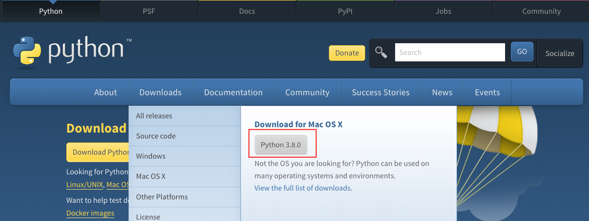
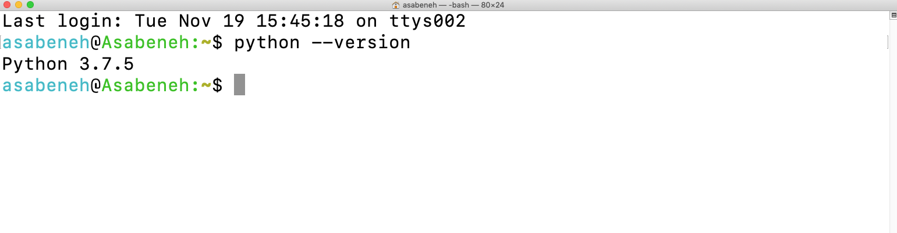
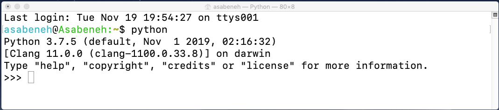
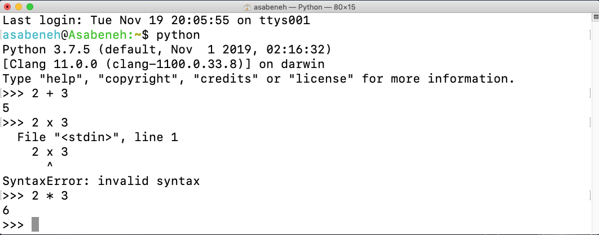
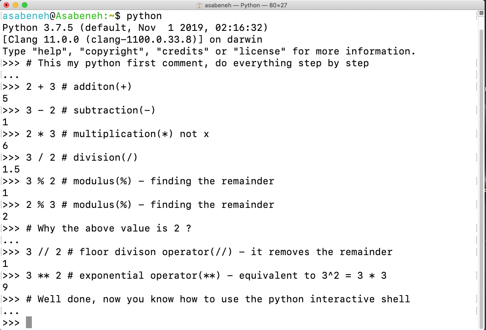
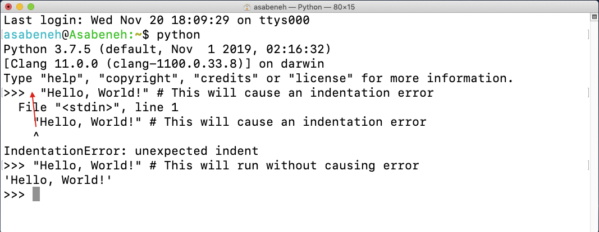
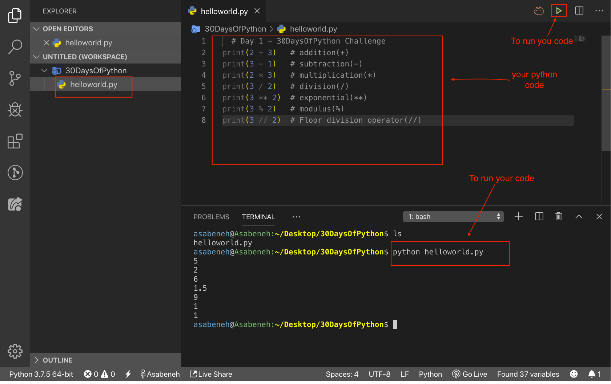

# 🐍 30 Günde Python 

|# Günler | Başlıklar                                                    |
|------|:---------------------------------------------------------:|
| 01  |  [Başlarken](./okubeni.md)|
| 02  |  [Değişkenler, Built-in Functions](./Gun_02/degiskenler-yerlesik-islevler.md)|
| 03  |  [Operators](./03_Day_Operators/03_operators.md)|
| 04  |  [Strings](./04_Day_Strings/04_strings.md)|
| 05  |  [Lists](./05_Day_Lists/05_lists.md)|
| 06  |  [Tuples](./06_Day_Tuples/06_tuples.md)|
| 07  |  [Sets](./07_Day_Sets/07_sets.md)|
| 08  |  [Dictionaries](./08_Day_Dictionaries/08_dictionaries.md)|
| 09  |  [Conditionals](./09_Day_Conditionals/09_conditionals.md)|
| 10  |  [Loops](./10_Day_Loops/10_loops.md)|
| 11  |  [Functions](./11_Day_Functions/11_functions.md)|
| 12  |  [Modules](./12_Day_Modules/12_modules.md)|
| 13  |  [List Comprehension](./13_Day_List_comprehension/13_list_comprehension.md)|
| 14  |  [Higher Order Functions](./14_Day_Higher_order_functions/14_higher_order_functions.md)|     
| 15  |  [Python Type Errors](./15_Day_Python_type_errors/15_python_type_errors.md)| 
| 16 |  [Python Date time](./16_Day_Python_date_time/16_python_datetime.md) |     
| 17 |  [Exception Handling](./17_Day_Exception_handling/17_exception_handling.md)|    
| 18 |  [Regular Expressions](./18_Day_Regular_expressions/18_regular_expressions.md)|    
| 19 |  [File Handling](./19_Day_File_handling/19_file_handling.md)|
| 20 |  [Python Package Manager](./20_Day_Python_package_manager/20_python_package_manager.md)|
| 21 |  [Classes and Objects](./21_Day_Classes_and_objects/21_classes_and_objects.md)|
| 22 |  [Web Scraping](./22_Day_Web_scraping/22_web_scraping.md)|
| 23 |  [Virtual Environment](./23_Day_Virtual_environment/23_virtual_environment.md)|
| 24 |  [Statistics](./24_Day_Statistics/24_statistics.md)|
| 25 |  [Pandas](./25_Day_Pandas/25_pandas.md)|
| 26 |  [Python web](./26_Day_Python_web/26_python_web.md)|
| 27 |  [Python with MongoDB](./27_Day_Python_with_mongodb/27_python_with_mongodb.md)|
| 28 |  [API](./28_Day_API/28_API.md)|
| 29 |  [Building API](./29_Day_Building_API/29_building_API.md)|
| 30 |  [Conclusions](./30_Day_Conclusions/30_conclusions.md)|

🧡🧡🧡 Mutlu Kodlamalar 🧡🧡🧡

<div>
<small>Merhaba <strong>Yazara</strong> bu eğitim materyali için destek olabilirsiniz.</small> <br />  
<a href = "https://www.paypal.me/asabeneh"></a>
</div>

<div align="center">
  <h1> 30 Günde Python: 1. Gün - Başlarken</h1>
  <a class="header-badge" target="_blank" href="https://www.linkedin.com/in/asabeneh/">
  
  </a>
  <a class="header-badge" target="_blank" href="https://twitter.com/Asabeneh">
  
  </a>

  <sub>Yazan:
  <a href="https://www.linkedin.com/in/asabeneh/" target="_blank"> Asabeneh Yetayeh Çeviren: Üçler Gönültaş</a><br>
  <small> İkinci Baskı: Temmuz, 2021</small>
  </sub>
</div>


[2. Gün >>](./02_Day_Variables_builtin_functions/02_variables_builtin_functions.md)


- [🐍 30 Günde Python](#-30-günde-python)
- [📘 1. Gün](#-1.-gün)
  - [Hoşgeldiniz](#Hoşgeldiniz)
  - [Açıklama](#açıklama)
  - [Niçin Python ?](#niçin-python-)
  - [Ortam Kurulumu](#ortam-kurulumu)
    - [Python'u Yüklemek](#pythonu-yüklemek)
    - [Python Shell](#python-shell)
    - [Visual Studio Code'u Yükleme](#visual-studio-code'u-yükleme)
      - [Visual Studio kod nasıl kullanılır? ](#visual-studio-code-nasıl-kullanılır?)
  - [Basit Python](#basit-python)
    - [Python Syntax](#python-syntax)
    - [Python Indentation](#python-indentation)
    - [Yorumlar](#yorumlar)
    - [Veri Tipleri](#veri-tipleri)
      - [Sayılar](#sayılar)
      - [String](#string)
      - [Booleans](#booleans)
      - [List](#list)
      - [Dictionary](#dictionary)
      - [Tuple](#tuple)
      - [Set](#set)
    - [eri türlerini kontrol etme](#veri-türlerini-kontrol-etme)
    - [Python Dosyası](#python-dosyası)
  - [💻 Alıştırma - 1.gün](#-alıştırma---1.gün)
    - [Alıştırma: Seviye 1](#alıştırma-seviye-1)
    - [Alıştırma: Seviye 2](#alıştırma-seviye-2)
    - [Alıştırma: Seviye 3](#alıştırma-seviye-3)

# 📘 1. Gün
## Hoşgeldiniz

**Tebrikler** _30 Günde Python_ öğrenmeye karar verdiğiniz için. Bu yazımızda, bir python programcısı olmak için ihtiyacınız olan her şeyi ve tüm programlama kavramını öğreneceksiniz. Yarışmanın sonunda bir _30GündePython_ programlama yarışması sertifikası alacaksınız.

Bu içeriği aktif olarak kullanmak istiyorsanız, [30GündePython İçeriği](https://t.me/ThirtyDaysOfPython) Telegram grubuna katılabilirsiniz. 

## Açıklama

Python, genel amaçlı programlama için üst düzey bir programlama dilidir. Açık kaynak kodlu, yorumlanmış, nesne yönelimli bir programlama dilidir. Python, Hollandalı bir programcı Guido van Rossum tarafından oluşturuldu. TPython programlama dilinin adı, bir İngiliz eskiz komedi dizisi olan *Month Python's Flying Circus*'tan türetilmiştir.  Tİlk sürüm 20 Şubat 1991'de yayınlandı. Bu 30 günlük Python macerası, Python'un en son sürümü olan Python 3'ü adım adım öğrenmenize yardımcı olacak. Konular, her gün anlaşılması kolay açıklamalar, gerçek dünyadan örnekler, birçok uygulamalı alıştırmalar ve projeler içeren birkaç konu içeren 30 güne bölünmüştür.

Bu meydan okuma, python programlama dilini öğrenmek isteyen yeni başlayanlar ve profesyoneller için tasarlanmıştır. Bu maceranın tamamlanması 30 ila 100 gün sürebilir, Telagram grubuna aktif olarak katılan kişilerin bu macerayı tamamlama olasılığı yüksektir.
Görsel bir öğreniciyseniz veya videolardan yanaysanız, bu [Mutlak Başlayanlar için Python videosu] ile başlayabilirsiniz.(https://www.youtube.com/watch?v=11OYpBrhdyM).

## Niçin Python ?

İnsan diline çok yakın, öğrenmesi ve kullanması kolay bir programlama dilidir.
Python, çeşitli endüstriler ve şirketler (Google dahil) tarafından kullanılır. Web uygulamaları, masaüstü uygulamaları, sistem yönetimi ve makine öğrenimi kitaplıkları geliştirmek için kullanılmıştır. Python, veri bilimi ve makine öğrenimi topluluğunda oldukça benimsenen bir dildir. Umarım bu sizi Python öğrenmeye başlamanız için ikna etmeye yeter. Python dünyayı yiyor ve o seni yemeden sen onu öldürüyorsun.

## Ortam Kurulumu

### Python'u Yüklemek

Bir python betiğini çalıştırmak için python'u yüklemeniz gerekir.Python'u [indirelim](https://www.python.org/).
Windows kullanıcısıysanız. Kırmızı daire içine alınmış butona tıklayın.

[](https://www.python.org/)

Bir macOS kullanıcısıysanız. Kırmızı daire içine alınmış butona tıklayın.

[](https://www.python.org/)

Python'un kurulu olup olmadığını kontrol etmek için cihazınızın terminaline aşağıdaki komutu yazın.

```shell
python --version
```



Terminalden de görebileceğiniz gibi şu anda _Python 3.7.5_ sürümünü kullanıyorum. Python sürümünüz benimkinden farklı olabilir, ancak 3.6 veya üstü olmalıdır. Python sürümünü görmeyi başarırsanız, aferin. Python makinenize kuruldu. Sonraki bölüme devam edin.

### Python Shell

Python yorumlanmış bir betik dilidir, bu nedenle derlenmesi gerekmez. Bu, kodu satır satır yürüttüğü anlamına gelir. Python, bir _Python Shell (Python Interactive Shell)_ ile birlikte gelir. Tek bir python komutunu yürütmek ve sonucu almak için kullanılır.
Python Shell, kullanıcıdan Python kodunu bekler. Kodu girdiğinizde, kodu yorumlar ve bir sonraki satırda sonucu gösterir.
Terminalinizi veya komut isteminizi (cmd) açın ve şunu yazın:

```shell
python
```



Python etkileşimli shell açıldı ve Python kodunu (Python betiği) yazmanızı bekliyor. Python betiğinizi bu sembolün yanına yazacaksınız >>> ve ardından Enter'a tıklayın.
İlk betiğimizi Python shell'e yazalım.


Tebrikler, ilk Python betiğinizi Python etkileşimli kabuğuna yazdınız. Python etkileşimli kabuğunu nasıl kapatırız?
Kabuğu kapatmak için bu sembolün yanına >> **exit()** komutunu yazın ve Enter'a basın.


Artık Python etkileşimli kabuğunu nasıl açacağınızı ve ondan nasıl çıkacağınızı biliyorsunuz.

Python'un anladığı komut dosyaları yazarsanız, Python size sonuç verir, aksi takdirde hata verir. Şimdi kasıtlı bir hata yapalım ve Python'un ne döndüreceğini görelim.


Döndürülen hatadan da görebileceğiniz gibi, Python o kadar akıllıdır ki, yaptığımız hatayı ve hangisinin _Syntax Error: geçersiz sözdizimi_ olduğunu bilir. Python'da çarpma olarak x kullanmak bir sözdizimi hatasıdır çünkü (x) Python'da geçerli bir sözdizimi değildir. Çarpma için (**x**) yerine yıldız işareti (*) kullanırız. Döndürülen hata, neyin düzeltileceğini açıkça gösterir.

Bir programdaki hataları belirleme ve kaldırma işlemine *hata ayıklama* denir. **x** yerine * koyarak hata ayıklayalım.



Hatamız giderildi, kod çalıştı ve beklediğimiz sonucu aldık. Bir programcı olarak bu tür hataları günlük olarak göreceksiniz. Hata ayıklamayı bilmek iyidir. Hata ayıklamada iyi olmak için ne tür hatalarla karşılaştığınızı anlamalısınız. Karşılaşabileceğiniz Python hatalarından bazıları şunlardır: *SyntaxError*, *IndexError*, *NameError*, *ModuleNotFoundError*, *KeyError*, *ImportError*, *AttributeError*, *TypeError*, *ValueError*, *ZeroDivisionError* vb. Farklı Python **_error types_** hakkında daha fazla bilgiyi sonraki bölümlerde göreceğiz.

Hadi artık pratik yapmaya başlayalım Terminalinize veya komut isteminize gidin ve şu kelimeyi yazın **python**.


Python etkileşimli kabuğu açılır. Bazı temel matematiksel işlemleri yapalım (toplama, çıkarma, çarpma, bölme, modül, üstel).

Herhangi bir Python kodu yazmadan önce biraz matematik yapalım:

- 2 + 3 = 5
- 3 - 2 = 1
- 3 \* 2 = 6
- 3 / 2 = 1.5
- 3 ^ 2 = 3 x 3 = 9

Python'da aşağıdaki ek işlemlere sahibiz:

- 3 % 2 = 1 => yani kalanı bulmak
- 3 // 2 = 1 => bu, kalanın kaldırılması anlamına gelir

Yukarıdaki matematiksel ifadeleri Python koduna değiştirelim. Python kabuğu açıldı ve kabuğun en başına bir yorum yazalım.

Bir _comment_, kodun python tarafından yürütülmeyen bir parçasıdır. Böylece kodumuzu daha okunabilir hale getirmek için kodumuza bir miktar metin bırakabiliriz. Python yorum kısmını çalıştırmaz. Python'da bir yorum hash(#) sembolü ile başlar.
Python'da bu şekilde yorum yazıyorsunuz.

```shell
 # yorum hash ile başlar
 # bu bir python yorumudur, çünkü (#) sembolü ile başlar
```



Bir sonraki bölüme geçmeden önce, Python etkileşimli kabuğu üzerinde daha fazla pratik yapalım. Kabuk üzerine _exit()_ yazarak açılan kabuğu kapatın ve tekrar açın ve Python kabuğuna nasıl metin yazılacağını öğrenelim..


### Visual Studio Code'u Yükleme

Python etkileşimli kabuğu, küçük komut dosyası kodlarını denemek ve test etmek için iyidir, ancak büyük bir proje için olmayacaktır.. Gerçek çalışma ortamında, geliştiriciler kod yazmak için farklı kod düzenleyicileri kullanır. Bu 30 günlük Python programlama mücadelesinde görsel stüdyo kodunu kullanacağız. Visual studio code, çok popüler bir açık kaynak metin düzenleyicisidir. Ben vscode hayranıyım ve görsel stüdyo kodunu [indirmenizi](https://code.visualstudio.com/) tavsiye ederim, ancak diğer editörlerden yanaysanız, sahip olduklarınızı takip etmekten çekinmeyin.

[](https://code.visualstudio.com/)

Visual studio code yüklediyseniz gelin nasıl kullanılacağını görelim.
Bir video tercih ederseniz, Python için bu Visual Studio Code'u takip edebilirsiniz [Video eğitimi](https://www.youtube.com/watch?v=bn7Cx4z-vSo)

#### Visual studio code nasıl kullanmılır

Görsel stüdyo simgesine çift tıklayarak görsel stüdyo kodunu açın. Açtığınızda bu tür bir arayüz elde edeceksiniz. Etiketli simgelerle etkileşim kurmayı deneyin.


Masaüstünüzde 30GündePython adlı bir klasör oluşturun. Ardından görsel stüdyo kodunu kullanarak açın.


Açtıktan sonra, 30GündePython projesinin dizini içinde dosya ve klasör oluşturmak için kısayollar göreceksiniz. Aşağıda görebileceğiniz gibi, ilk dosya olan helloworld.py'yi oluşturdum. Sen de aynısını yapabilirsin.


Uzun bir kodlama gününden sonra kod düzenleyicinizi kapatmak istiyorsunuz, değil mi? Açılan projeyi bu şekilde kapatacaksınız.


Tebrikler, geliştirme ortamını ayarlamayı bitirdiniz. Hadi kodlamaya başlayalım.

## Basit Python

### Python Syntax

Bir Python betiği, Python etkileşimli kabuğunda veya kod düzenleyicide yazılabilir. Bir Python dosyasının uzantısı .py'dir.

### Python Indentation

Girinti, metindeki beyaz bir boşluktur. Birçok dilde girinti, kodun okunabilirliğini artırmak için kullanılır, ancak Python, kod bloğu oluşturmak için girintiyi kullanır. Diğer programlama dillerinde girinti yerine kod blokları oluşturmak için küme parantezleri kullanılır. Python kodu yazarken sık karşılaşılan hatalardan biri yanlış girintidir.



### Yorumlar

Yorumlar, kodun daha okunabilir olması ve kodumuzda açıklamalar bırakılabilmesi için çok önemlidir. Python, kodumuzun yorum kısımlarını çalıştırmaz.
Python'da hash(#) ile başlayan herhangi bir metin bir yorumdur.

**Örnek: Tek Satır Yorumu**

```shell
    # Bu ilk yorum
    # Bu ikinci yorum
    # Python dünyayı yiyor
```

**Örnek: Çok Satırlı Yorum**

Bir değişkene atanmamışsa, çok satırlı yorum için üçlü alıntı kullanılabilir

```shell
"""Bu, çok satırlı yorum
yapabilmemizi sağlar
"""
```

### Veri tipleri

Python'da birkaç tür veri türü vardır. En yaygın olanlarla başlayalım. Farklı veri türleri diğer bölümlerde ayrıntılı olarak ele alınacaktır. Şimdilik, farklı veri türlerini inceleyelim ve onlara aşina olalım. Şimdi net bir anlayışa sahip olmak zorunda değilsiniz.

#### Sayı

- Integer: tamsayı'(negatif, sıfır ve pozitif) lar
    Örnek:
    ... -3, -2, -1, 0, 1, 2, 3 ...
- Float: Ondalıklı sayılar
    Örnek
    ... -3.5, -2.25, -1.0, 0.0, 1.1, 2.2, 3.5 ...
- karmaşık
    Örnek
    1 + j, 2 + 4j

#### String

Tek veya çift tırnak altında bir veya daha fazla karakterden oluşan koleksiyon. Bir dize birden fazla cümleyse, üçlü bir alıntı kullanırız.

**Örnek:**

```py
'Asabeneh'
'Finland'
'Python'
'I love teaching'
'I hope you are enjoying the first day of 30DaysOfPython Challenge'
```

#### Boolean'lar

Boolean veri türü, True veya False değeridir. T ve F her zaman büyük harf olmalıdır.

**Örnek:**

```python
    True  #  Işık açık mı? Açıksa, değer True'dur
    False # Işık açık mı? Kapalıysa, değer False'dur.
```

#### List

Python listesi, farklı veri tipi öğelerin depolanmasına izin veren sıralı bir koleksiyondur. Liste, JavaScript'teki bir diziye benzer.

**Örnek:**

```py
[0, 1, 2, 3, 4, 5]  # hepsi aynı veri türleridir - bir sayı listesi
['Banana', 'Orange', 'Mango', 'Avocado'] # hepsi aynı veri türleri - dizilerin listesi (meyveler)
['Finland','Estonia', 'Sweden','Norway'] # hepsi aynı veri türleri - bir dizi listesi (ülkeler)
['Banana', 10, False, 9.81] # listedeki farklı veri türleri - dize, tamsayı, boolean ve kayan nokta
```

#### Sözlük

Python sözlük nesnesi, bir anahtar değer çifti biçiminde sıralanmamış bir veri koleksiyonudur.

**Örnek:**

```py
{
'first_name':'Asabeneh',
'last_name':'Yetayeh',
'country':'Finland', 
'age':250, 
'is_married':True,
'skills':['JS', 'React', 'Node', 'Python']
}
```

#### Tuple

Bir Tuple, liste gibi farklı veri türlerinin sıralı bir koleksiyonudur, ancak demetler oluşturulduktan sonra değiştirilemez. Onlar değişmez.

**Örnek:**

```py
('Asabeneh', 'Pawel', 'Brook', 'Abraham', 'Lidiya') # İsimler
```

```py
('Earth', 'Jupiter', 'Neptune', 'Mars', 'Venus', 'Saturn', 'Uranus', 'Mercury') # Gezegenler
```

#### Set

Küme, liste ve demete benzer bir veri türleri topluluğudur. Liste ve demetten farklı olarak set, sıralı bir öğe koleksiyonu değildir. Matematikte olduğu gibi, Python'da sadece benzersiz öğeleri saklar.

Daha sonraki bölümlerde, her bir Python veri türü hakkında ayrıntılı olarak gideceğiz.

**Örnek:**

```py
{2, 4, 3, 5}
{3.14, 9.81, 2.7} # sette sıra önemli değil
```

### Veri türlerini kontrol etme

Belirli verilerin/değişkenlerin veri türünü kontrol etmek için **type** işlevini kullanırız. Aşağıdaki terminalde farklı python veri türleri göreceksiniz:


### Python Dosyası

Önce proje klasörünüzü açın, 30GündePython. Bu klasöre sahip değilseniz, 30GündePython adında bir klasör adı oluşturun. Bu klasörün içinde helloworld.py adlı bir dosya oluşturun. Şimdi görsel stüdyo kodunu kullanarak python interaktif kabuğunda yaptığımızı yapalım.

Python etkileşimli kabuğu, **print** kullanmadan yazdırıyordu, ancak sonucumuzu görmek için görsel stüdyo kodunda yerleşik bir *print() işlevi kullanmalıyız. *print()* yerleşik işlevi aşağıdaki gibi bir veya daha fazla bağımsız değişken alır *print('argument1', 'argument2', 'argument3')*. Aşağıdaki örneklere bakın.

**Örnek:**

Dosya adı helloworld.py

```py
# 1.Gün - 30GündePython Challenge

print(2 + 3)             # toplama(+) 
print(3 - 1)             # çıkarma(-)
print(2 * 3)             # çarpma(*)
print(3 / 2)             # bölme(/)
print(3 ** 2)            # üstünü alma(**)
print(3 % 2)             # mod(%)
print(3 // 2)            # kalansız bölme(//)

# Checking data types
print(type(10))          # Int
print(type(3.14))        # Float
print(type(1 + 3j))      # Complex number
print(type('Asabeneh'))  # String
print(type([1, 2, 3]))   # List
print(type({'name':'Asabeneh'})) # Dictionary
print(type({9.8, 3.14, 2.7}))    # Set
print(type((9.8, 3.14, 2.7)))    # Tuple
```

Python dosyasını çalıştırmak için aşağıdaki resmi kontrol edin. Python dosyasını Visual Studio Code üzerinde yeşil butonu çalıştırarak veya terminalde *python helloworld.py* yazarak çalıştırabilirsiniz.



🌕  Harikasın. 1. gün mücadelesini yeni tamamladınız ve mükemmellik yolundasınız. Şimdi öğrendiklerimizi pekiştirmek için alıştırma yapalım.

## 💻 Alıştırmalar - 1. Gün

### Alıştırma: Seviye 1

1. Kullanmakta olduğunuz python sürümünü kontrol edin
2. Python interaktif kabuğunu açın ve aşağıdaki işlemleri yapın. Sayılar sırası ile 3 ve 4'tür.
   - toplama(+)
   - çıkarma(-)
   - çarpma işlemi(\*)
   - mod(%)
   - bölme(/)
   - üstel(\*\*)
   - kalansız bölme(//)
3. Python konsoluna aşağıdakileri yazdırın.
   - İsminiz
   - Soyadın
   - Yaşadığını şehir
   - Ben 30 Günde Python öğreniyorum
4. Aşağıdaki verilerin veri türlerini kontrol edin:
   - 10
   - 9.8
   - 3.14
   - 4 - 4j
   - ['Asabeneh', 'Python', 'Finland']
   - Adın
   - Soyadın
   - Ülken

### Alıştırma: Seviye 2

1. 30GündePython klasörü içinde gün_1 adında bir klasör oluşturun. gün_1 klasöründe bir python dosyası helloworld.py oluşturun ve 1, 2, 3 ve 4. soruları tekrarlayın. Bir python dosyası üzerinde çalışırken _print()_ kullanmayı unutmayın. Dosyanızı kaydettiğiniz dizine gidin ve çalıştırın.

### Alıştırma: Seviye 3

1. Number(Integer, Float, Complex), String, Boolean, List, Tuple, Set ve Dictionary gibi farklı Python veri türleri için bir örnek yazın.
2. Şunu bul [Öklid mesafesi](https://en.wikipedia.org/wiki/Euclidean_distance#:~:text=In%20mathematics%2C%20the%20Euclidean%20distance,being%20called%20the%20Pythagorean%20distance.) between (2, 3) and (10, 8)

🎉 TEBRİKLER ! 🎉

[2.Gün >>](./Gun_02/degiskenler-yerlesik-islevler.md)